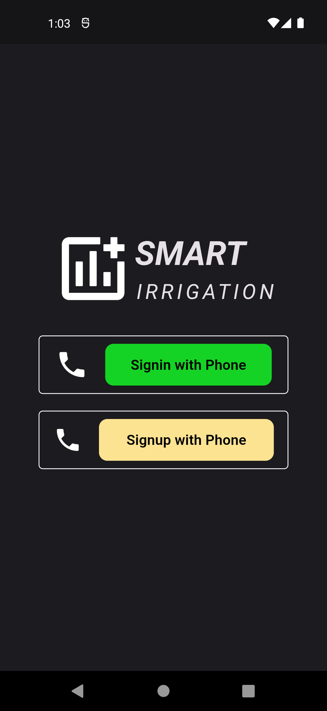
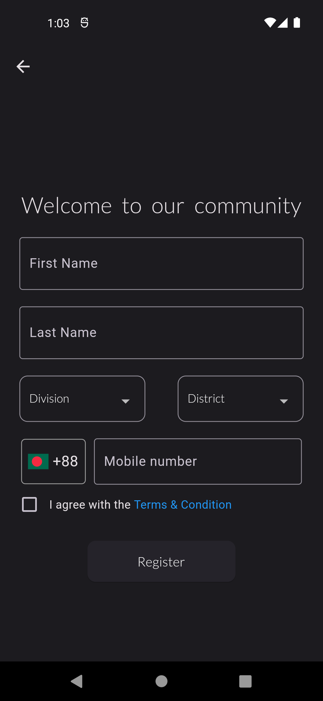
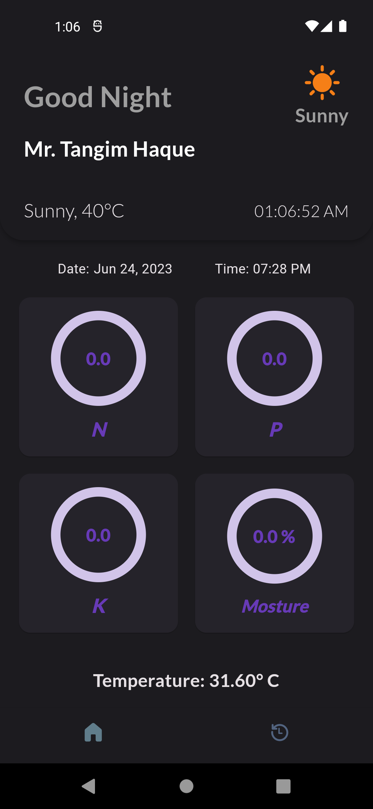
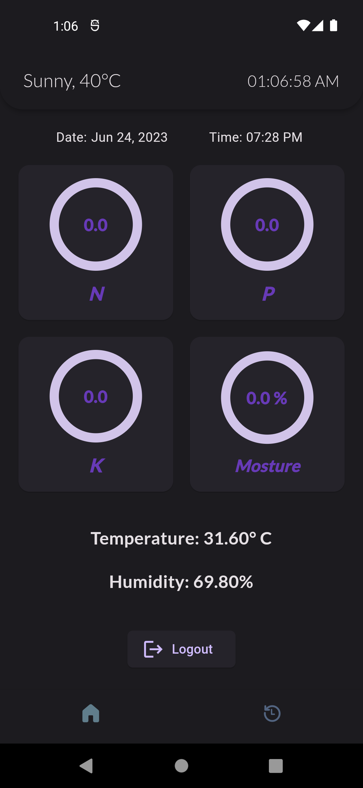

# Smart Irrigartion System

The "Smart Irrigation System" app is a user-friendly and intuitive mobile application designed to empower users with real-time insights into their agricultural or gardening practices. The app serves as a comprehensive tool for monitoring and optimizing the health of plants by providing two essential features: real-time NPK sensor data and historical NPK data stored in a database.

The main focus of the app revolves around the NPK (Nitrogen, Phosphorus, and Potassium) sensor, a vital component for assessing the nutrient levels in soil. The real-time NPK sensor feature displays the current nutrient levels of the soil, enabling users to instantly gauge the health of their plants. This real-time data is crucial for making informed decisions about when and how much to irrigate, as well as for applying appropriate fertilizers.

In addition to real-time monitoring, the app also offers a historical data feature. This feature allows users to access and review past NPK data collected from the sensor and stored in a database. This historical data serves as a valuable resource for tracking trends, understanding the impact of different irrigation and fertilization practices, and making long-term adjustments to optimize plant growth.

Visually, the app boasts an intuitive user interface that presents the real-time and historical data in an easily digestible format. Graphs, charts, and visualizations offer a clear representation of NPK levels over time, aiding users in making informed decisions. The app's navigation is user-friendly, ensuring that even users who are new to smart irrigation technology can seamlessly navigate through its features.

In conclusion, the "Smart Irrigation System" app is a powerful tool for both novice and experienced gardeners, farmers, and agricultural enthusiasts. By providing real-time NPK sensor data and historical insights, the app empowers users to make precise and impactful decisions regarding irrigation and fertilization practices, leading to healthier and more vibrant plant growth.

## Screenshots

